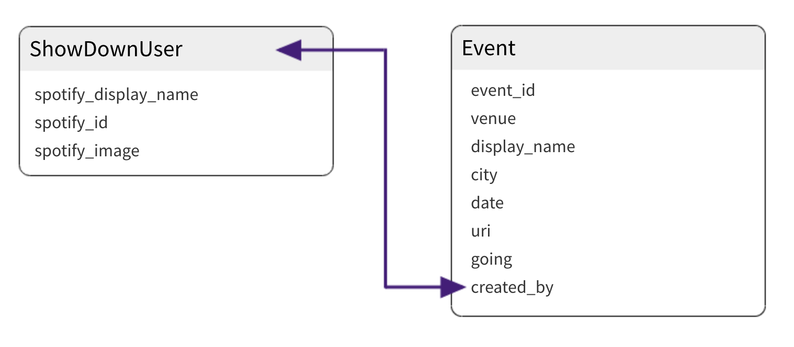

<h1 style="text-align: center;"> —---— SHOWDOWN —---— </h1>

The idea for this app came to me when I realized that my “Spotify Artists” did not include artists appearing only in one of my playlists (Spotify generates a users Artists list based on whether the user A- has saved a song from the artist, or B- is following the artist)

Although brilliant in many ways, Spotify also does not offer the user the ability to view all upcoming concerts of all said user's artists in one place (the user has to instead already know what specific Artist's concerts they wish to look up).

#### Enter ShowDown. ####

An app where users are able to see all their favorite artists’ upcoming live events (provided by Songkick) in one place. Only condition for artist's shows to be tracked: the artist must be included in a user's Spotify playlist. The reasoning behind this constraint is to motivate users to create their own unique playlists.

The point of the application is twofold:
- Spreading live love
- Encouraging users to create playlists relevant to their tastes

---

## Users will be able to: ##
- Login to their Spotify account (if not, will be prompted to register).
- Add events to their calendar.
- Update events in their calendar ('going', 'maybe', 'not going').
- View all their artists.
- View an artist’s upcoming concerts, if any.

## User Stories: ##
- User logs in through their Spotify account.
- User is redirected to ShowDown profile page.
- User has access to their Artists, Playlists, potential Events, and Calendar.
	- Artists will be compiled from playlists (for an artist to be tracked, there must be at least ONE track of that artist included in ONE of the user’s playlists)
	- Playlists will be user's Spotify playlists.
	- Potential Events will be compiled from artists.
	- Calendar will contain all events user is contemplating attending.

### Example 1: ###
- User wishes to see when Artist A will be playing next.
- User searches their artists.
- User finds Artist A, clicks on Artist A.
- User is redirected to Artist A’s upcoming concerts in SongKick.

### Example2: ###
- User wishes to see all of their compiled upcoming Events.
- User goes to Events, ShowDown scans their Playlists.
- Chronologically ascending list of Events appear.
- User may choose to add a concert to their calendar by clicking “Add to Calendar.”

---

## Technologies Used: ##
- PostgreSQL 11
- Python 3.7 / Django 2.1.3
- Node.js / React.js

---

## Setup: ##
- Technologies above required
- git fork/clone

### In your CLI: ###
- Navigate to root folder

`$ npm install`
- Create your virtual environment:

```
$ pip3 install virtualenv
$ virtualenv .env -p python3
$ source .env/bin/activate
$ pip install -r requirements.txt
```
- Create a secrets.py file in the root directory. Inside, add your secrets/keys. Example secrets.py:

```
# Django Secret Key
SECRET_KEY = 'yourdjangosecretstring'
# DataBase Password
DATABASE_PASSWORD = 'yourdatabasepassword'
# Spotify
SPOTIPY_CLIENT_ID = 'yourspotifyclientid'
SPOTIPY_CLIENT_SECRET = 'yourspotifyclientsecret'
# Songkick
SONGKICK_API_KEY = 'yoursongkickapikey'
```
- After your secrets are all set up, run your backend

`python manage.py runserver`

- I a seperate tab, still in your root folder, run your frontend!

`npm start`

### You're in! ###

---

## APIs: ##
#### Songkick (pretty straightforward): ####
- Request an API key on [their website](https://www.songkick.com/api_key_requests/new), they will email you with the key once they approve of your project.
- The API endpoint used for this project was the ['Artist’s upcoming events (calendar)'](https://www.songkick.com/developer/upcoming-events-for-artist).

#### Spotify (was a bit of a doozy): ####
- [Login to/Create](https://developer.spotify.com/dashboard/login) your Spotify account.
- Through your Spotify Dashboard, create a new App.
- Retrieve Client ID and Client Secret from created App.
- Scope for this project was playlist-modify-public playlist-modify-private (alter if needed in view_spotify.py)
- API endpoints:
	- [Get List of Current User's Playlists](https://developer.spotify.com/documentation/web-api/reference/playlists/get-a-list-of-current-users-playlists/)
	- [Get a Playlist's Tracks](https://developer.spotify.com/documentation/web-api/reference/playlists/get-playlists-tracks/)

---

## Entity Relationship Diagram: ##

<p style="text-align: center;"></p>

---

<h2 style="text-align: center;"> WIREFRAMES </h2>


<p style="text-align: center; width: 30%"></p>
<p style="text-align: center; width: 60%;"></p>
<p style="text-align: center;"></p>
<p style="text-align: center;"></p>
<p style="text-align: center;"></p>
<p style="text-align: center;"></p>

---

### Upcoming Features: ###
- Full Spotify functionality (user will be able to Create, Edit, Delete their Spotify playlists).
- Optional concerts recommendations of artists similar to those in playlists.
- Filter functionality for events based on city.
- View details of concert/venue within ShowDown (no redirect).

<h2 style="text-align: center;"> Upcoming Features' Wireframes </h2>

<p style="text-align: center;"></p>
<p style="text-align: center;"></p>
<p style="text-align: center;"></p>


