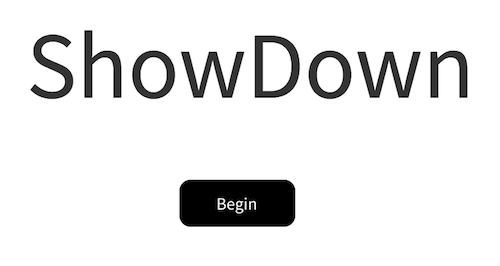
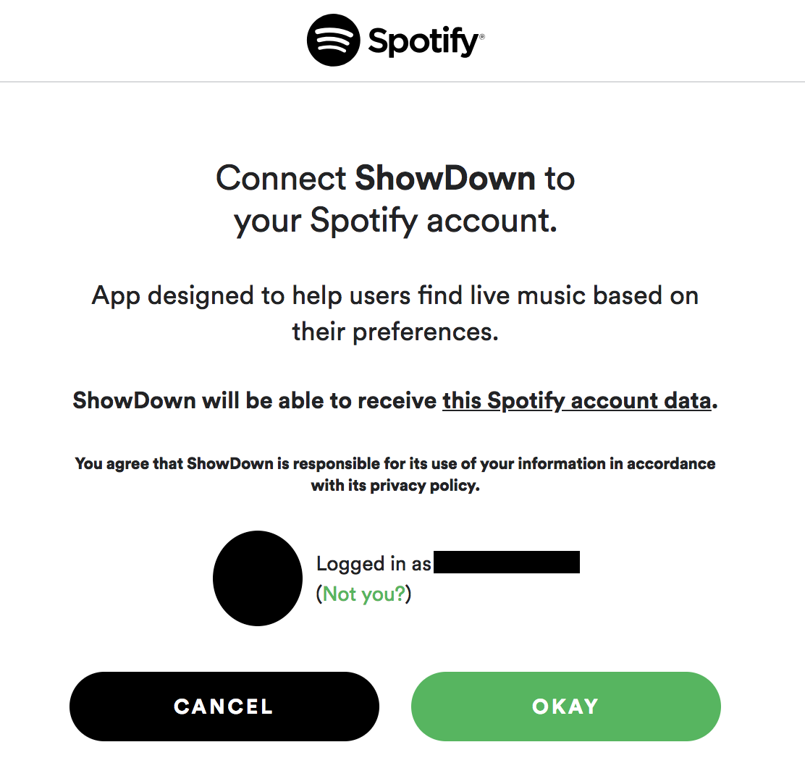
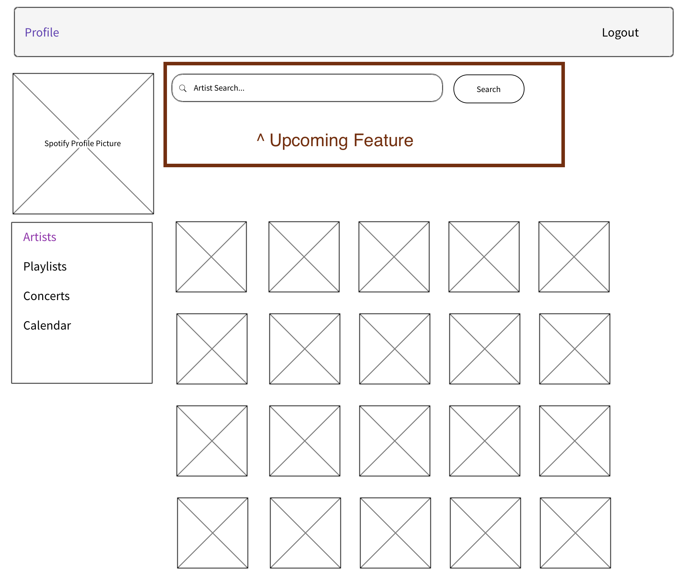
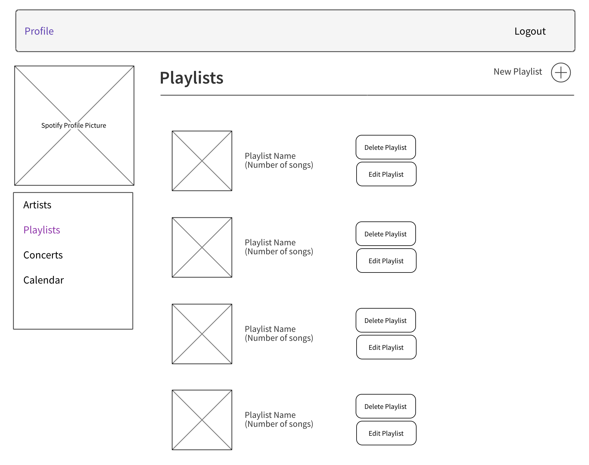
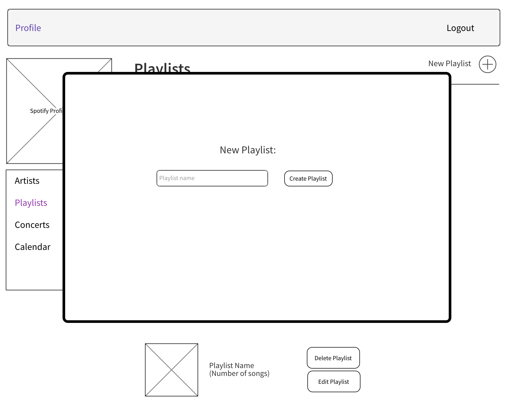
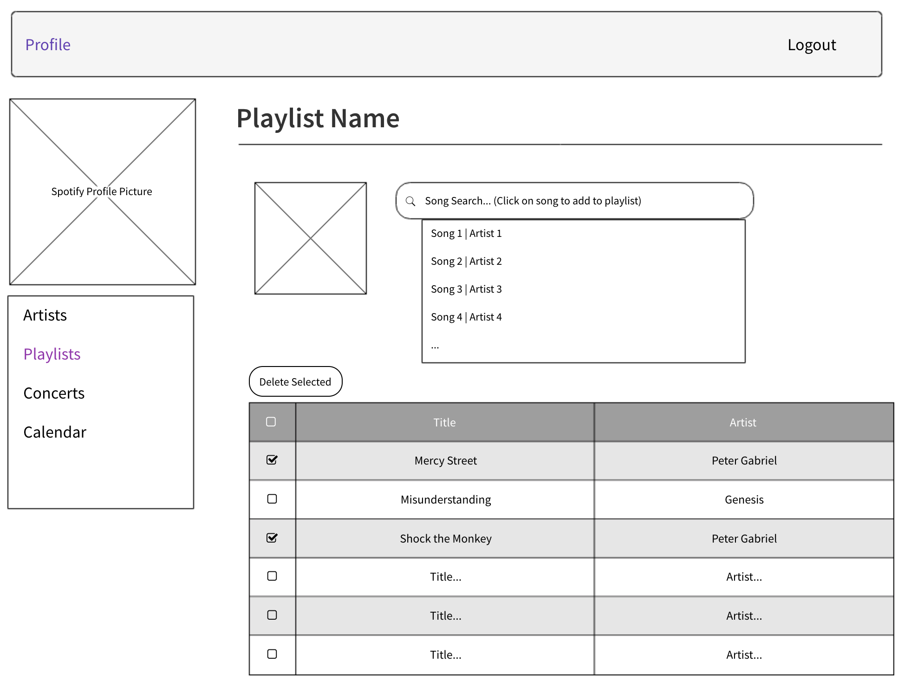
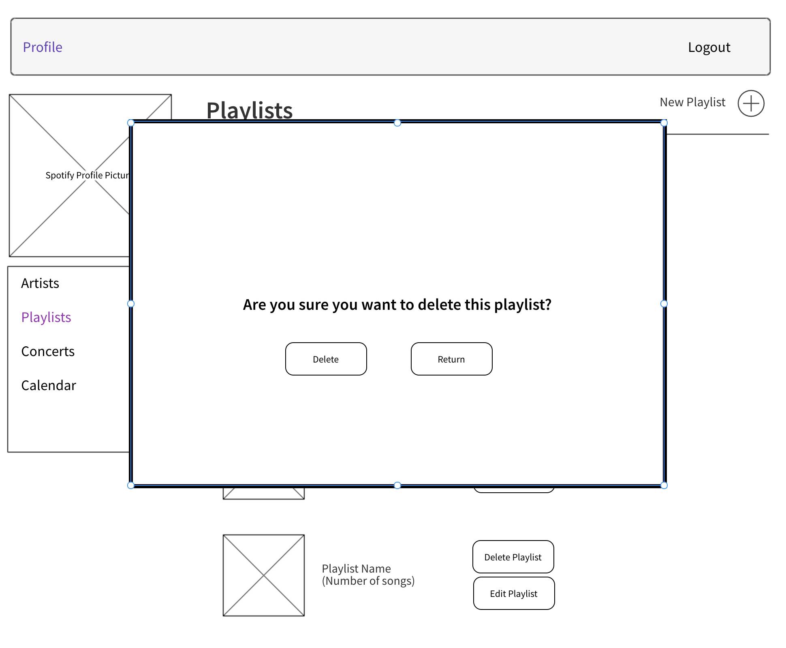
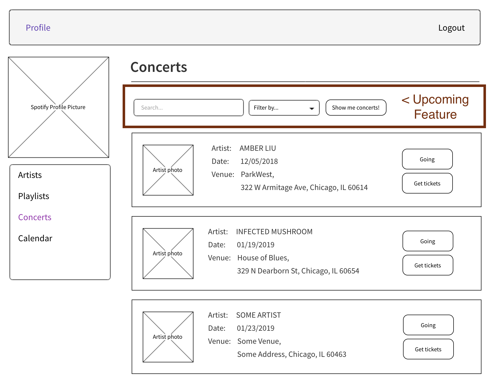
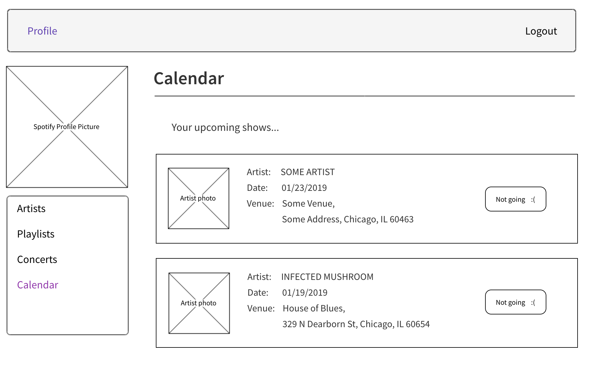

<h1 style="text-align: center;"> —---— SHOWDOWN —---— </h1>

The idea for this app came to me when I realized that my “Spotify Artists” did not include artists appearing only in one of my playlists (meaning A: I was not following the artist, and B: I hadn’t “saved” any of their songs). Spotify, although brilliant in many ways, does not offer the user the ability to view all upcoming concerts of all said user's artists in one place (the user has to instead already know what specific Artist's concerts they wish to look up).

#### Enter ShowDown. ####

An app where users are able to see all their favorite artists’ upcoming live events in one place. Only condition for artist's shows to be tracked: the artist must be included in a user playlist. The reasoning behind this constraint is to motivate users to create their own unique playlists.

The point of the application is twofold:

- Spreading live love
- Encouraging users to create playlists relevant to their tastes

## Users will be able to: ##
- Login to their Spotify account (if not, will be prompted to register).
- Create, View, Update and Delete their playlists.
- Search for artists and tracks to add to a playlist.
- View all their artists.
- View an artist’s upcoming concerts, if any.
- View a “calendar” of upcoming concerts.
- View a link to venue/purchase tickets.

## User Stories: ##
- User logs in through their Spotify account.
- User is redirected to ShowDown profile page.
- User will be able to see all artists tracked for concerts (i.e. any artist included in a user’s playlist).
- For an artist to be tracked, there must be at least ONE track of that artist included in ONE user’s playlists

### Example 1: ###
- User wishes to see when Artist A will be playing next
- User searches their artists
- User finds Artist A, clicks on Artist A
- User views Artist A’s upcoming concerts (date, venue, link to purchase tickets, [Going])
- User may choose to add a concert to their calendar by clicking “Going”

### Example2: ###
- User wishes to see when Artist B will be playing next
- User searches their artists
- Oops! Artist not found (meaning artist was not found in any playlists)
- User goes to their playlists
- User creates/edits a playlist, adds song(s) by Artist B
- Artist B is now included in user's artists

<h2 style="text-align: center;"> WIREFRAMES </h2>

      
### Upcoming Features: ###
- Recommend concerts of artists similar to those in playlists
- View details of concert/venue